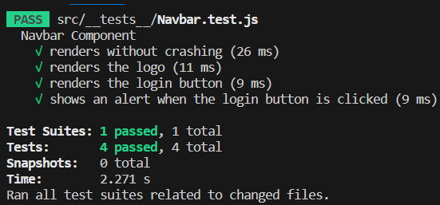

# FrontEnd Testing

## User Interface elements

### Navbar.js

1. Checking if the **Navbar** component renders without crashing.
2. Checking if the logo is rendered.
3. Checking if the login button is rendered.
4. Checking if an alert is shown when the login button is clicked.

## Game Board Generation & User Interaction

## Game Timer

## Scoring Functionality

## Leaderboard Display & User Ranking Updates

## User Registration & Login & Authentication
