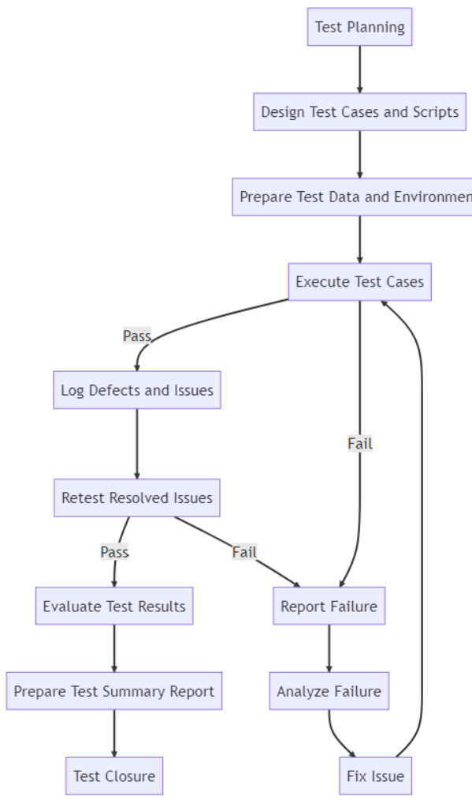

# QA Test Plan for Word Search Puzzle Web Application

## 1. Introduction

The test plan outlines the testing objectives, strategies, and methodologies for the Word Search Puzzle web application. The goal is to ensure that the application meets its functional and non-functional requirements and specifications, providing a smooth user experience.

## 2. Test Objectives

- Ensure the application meets functional requirements and specifications.
- Validate the correctness and reliability of the application.
- Identify and resolve any defects or issues before the application is released.

## 3. Test Schedule

- Collaborate with the development team to create a testing schedule aligned with the project timeline and milestones.
- Regularly review test results and address any defects or issues identified during the testing process.
- Here is a figure for demonstrating the test procedure:

  

## 3. Test Strategy

The testing will be conducted at different levels, including unit testing, integration testing, and system testing. Both manual and automated testing methodologies will be employed.

### 3.1 Test Levels

#### 3.1.1 Unit Testing

- Test individual components, functions, or modules in isolation.
- Use **Jest** for frontend testing and **pytest** for backend testing.
- Automate unit tests to facilitate continuous integration and early defect detection.

#### 3.1.2 Integration Testing

- Test the interaction and communication between different components or modules.
- Ensure the integrated system works correctly and meets the specified requirements.
- Test API endpoints to validate correct data flow between the front end and back end.

#### 3.1.3 System Testing

- Test the entire application as a whole, including frontend, backend, and database.
- Perform end-to-end testing to ensure the system meets functional and non-functional requirements.
- Test user scenarios and workflows to validate the application's overall functionality and usability.

## 3.2 Test Methodologies

### 3.2.1 Manual Testing

- Test the application manually to identify defects, usability issues, and unexpected behavior.
- Perform exploratory testing to uncover issues that may not be detected by automated tests.

### 3.2.2 Automated Testing

- Develop automated test scripts to validate the application's functionality and performance.
- Integrate automated tests into the continuous integration and deployment pipeline.

### 3.2.3 Performance Testing

- Test the application's performance under various conditions, such as laptop and mobile browsers.
- Identify potential bottlenecks and optimize the application for better performance.

## 4. Test Cases

### 4.1 Frontend Test Cases

- Test the user interface elements, such as buttons, input fields, and navigation components.
- Test the game board generation and user interactions with the game board.
- Test the game timer and scoring functionality.
- Test the leaderboard display and user ranking updates.
- Test user registration, login, and authentication.

### 4.2 Backend Test Cases

- Test the user authentication functionality, including registration and login.
- Test the game data management, such as storing and retrieving puzzles, user scores, and leaderboards.
- Test the puzzle generation algorithm, ensuring that generated puzzles meet level requirements.
- Test the API endpoints for proper communication between the front end and backend.
- Test the database design and data storage, ensuring data consistency and integrity.

## 5. Test Tools and Frameworks

- Frontend testing: Jest, React Testing Library, Selenium (for end-to-end testing).
- Backend testing: pytest, Postman (for API testing), locust (for performance testing).

### 5.1 pytest

- pytest is a popular Python testing framework that is used for backend testing in this project.
- It provides a simple and concise syntax for writing test cases and supports various plugins and extensions to enhance its functionality.
- It enables test discovery and execution, making organizing and running tests for the backend components easier.
- py test will be used for writing and executing unit tests for the backend components, ensuring the correctness and reliability of the application.

## 7. Test Deliverables

- Test plan document
- Test
- cases and scripts

  - Test data and expected results
  - Test environment setup and configuration
  - Test execution results and reports
  - Bug and issue reports
  - Test summary report

## 8. Test Environment

- Set up a dedicated testing environment that closely resembles the production environment.
- Ensure that all necessary dependencies, tools, and configurations are in place for testing.
- Prepare test data, including sample puzzles, user accounts, and leaderboard data.

## 9. Test Execution

- Execute the test cases and scripts according to the test schedule.
- Record test results, including any defects or issues discovered during testing.
- Retest any resolved issues to ensure that they have been properly addressed.

## 10.Test Evaluation and Reporting

- Analyze test results to identify trends and patterns in the application's behavior.
- Document any defects or issues discovered during testing, along with their severity and impact.
- Provide recommendations for resolving identified issues and improving the application's overall quality.
- Prepare a test summary report, detailing the test objectives, methodologies, results, and conclusions.

## 11. Test Closure

- Review the test summary report with the development team and other stakeholders.
- Ensure all critical issues are addressed and resolved before releasing the application.
- Conduct a post-mortem analysis to evaluate the effectiveness of the testing process and identify areas for improvement in future projects.

  By following this QA test plan, the Word Search Puzzle web application can be thoroughly tested and evaluated, ensuring a high-quality user experience and a reliable, functional product.
