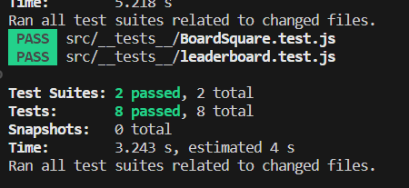
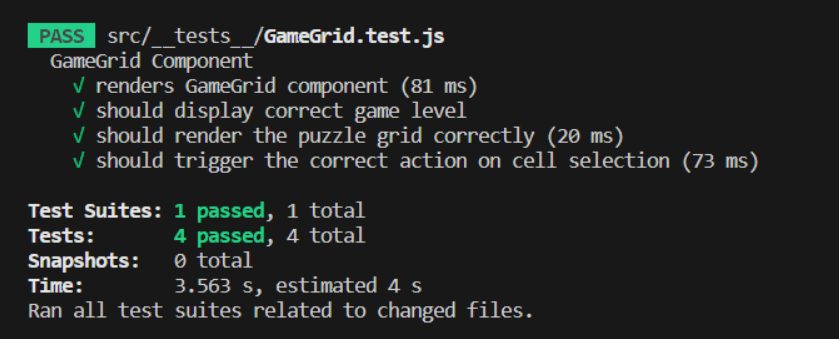

# FrontEnd Testing

## User Interface elements

### Button.js

- The `renders correctly` test ensures that the button component is properly rendered with the correct text.
- The `handles click correctly` test ensures that the onClick handler function is triggered correctly when the button is clicked.
- The `renders with additional styles` test checks if the button component correctly applies any additional CSS classes provided.
- The `renders with correct butto type` test verifies that the button is rendered with the correct 'type' attribute, which can be crucial for forms where the button type may be 'submit', 'reset', or 'button'.

### boardsquare.js

1. **Rendering**: It checks whether the component can be rendered without crashing. It accomplishes this by rendering the `BoardSquare` component and checking that the first child of the container is present in the document.
2. **Click Handler**: It checks whether the `handleClick` function prop is invoked correctly when the component is clicked. It simulates a click event on the `BoardSquare` component and then verifies that `handleClick` was called with the correct arguments.
3. **Class Assignment (when clicked and opened)**: It checks whether the correct CSS classes are applied to the component when it has been both clicked and opened. It renders the `BoardSquare` component with the `clicked` and `opened` props set to `true`, then checks the component for the expected CSS classes.
4. **Class Assignment (when opened but not clicked)**: It checks whether the correct CSS classes are applied to the component when it is opened but not clicked. It renders the `BoardSquare` component with the `opened` prop set to `true` and the `clicked` prop set to `false`, then checks the component for the expected CSS classes.
5. **Class Assignment (when neither opened nor clicked)**: It checks whether the correct CSS classes are applied to the component when it is neither clicked nor opened. It renders the `BoardSquare` component with both the `clicked` and `opened` props set to `false`, then checks the component for the expected CSS classes.

### Leaderboard.js

BoardSquare_Leaderboard.png

1. **Fetches data from the server and displays the leaderboard**: It checks if the LeaderBoard component fetches data from the server and correctly displays the leaderboard based on the received data.
2. **Fetches data when the refresh button is clicked:** It verifies that the LeaderBoard component makes an API call when the refresh button is clicked and ensures that the API is called with the correct endpoint.
3. **Shows "No scores to show" when there is no leaderboard data**: It tests if the LeaderBoard component correctly displays the "No scores to show" message when there is no leaderboard data available.

## GameGrid.js

1. `'renders GameGrid component'`: This test verifies that the GameGrid component can render without errors. The 'WORDS TO FIND' string is used as an indicator that the component has rendered correctly, assuming that this string is present in the component.
2. `'should display correct game level'`: This test checks whether the correct game level is displayed in the GameGrid component. It uses the level provided in the `mockProps` and checks if this level appears in the rendered component.
3. `'should render the puzzle grid correctly'`: This test validates that the puzzle grid in the GameGrid component is rendered correctly. It checks that there are the correct number of rows and cells, based on the `size` provided in the `mockProps`.
4. `'should trigger the correct action on cell selection'`: This test is meant to confirm that clicking a cell in the GameGrid component triggers the correct action. This could be, for example, highlighting the cell or marking it as selected. The exact expectation is not specified in the current test code, so it needs to be added based on what action you expect to happen when a cell is clicked.

